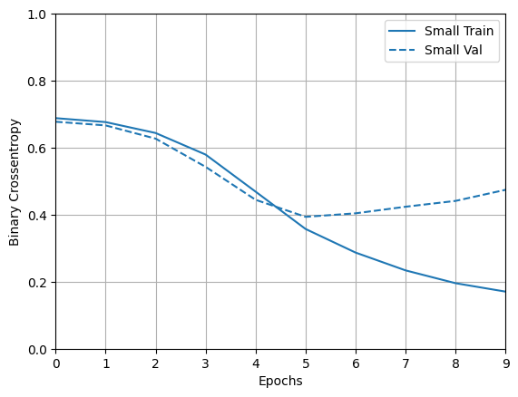

# Image Classifier: Plant Health

## Summary

Due to climate change, there is an increased need to address resource scarcity. It is desirable to have an automated plant health monitoring system that can detect when a plant is experiencing stress such as wilting (underwatering). The user can experiment with the growing environment (i.e. the watering frequency) and use the monitoring system to track the plant's health. 

This project is a prototype of such a monitoring system.  We use TensorFlow and Keras to create an image classifier which detects if a house plant is healthy or wilted. We make adjustments to fix the overfitting and pursue hyperparameter tuning. 

## Description

We construct a database of images of common house plants from Google Images using the batch downloader [Fatkun](https://chrome.google.com/webstore/detail/fatkun-batch-download-ima/efcapamiilmdfbbilogcddbdckjhpajj). The two categories are "healthy" and "wilted". We will train a neural net to predict which category a given image belongs to. In what follows, we outline our methods and results. 

## Dataset creation, preprocessing, and cleaning

Before gathering images for the data set, we come across our first question: how many images do we need?
After a quick search, we find that we find that typically [100 images of each category](https://www.microfocus.com/documentation/idol/IDOL_12_0/MediaServer/Guides/html/English/Content/Training/ImageClass_ImageGuide.htm#:~:text=Usually%20around%20100%20images%20are,typically%20found%20within%20the%20class.) is sufficient to train a Neural Network. 

The two categories we consider are "healthy" and "wilted". To populate the wilted category, we gather images matching the keywords "house plant", "healthy house plant", and "indoor plant". To populate the wilted category, we use the keywords "wilted house plant", "wilted indoor plant", and "droopy house plant".  

As a first pass at cleaning the data set, we require the image to: 
- [ ] show a full, clear view of the plant (not just leaves or trunk)
- [ ] no more than three plants in the image
- [ ] mostly matured plants (no seedlings)
- [ ] images of real plants (no drawings)
- [ ] variety of house plants (including succulents, ivies, woody trunked)
- [ ] allowing distractions (humans, various pot types, different points of view, plant not in center of the image)
- [ ] For healthy category: the image only has healthy plants (no mixture of sick and healthy)
- [ ] For wilted category: allow a mixture of sick and healthy, but at lease one sick plant

Once we have the data, we take a second pass at cleaning:
- [ ] remove links that are broken
- [ ] check the image has correct file formatting (only allow .jpg, convert file type when necessary)
- [ ] remove duplicate images (same file name)

When we are finished with these steps, we were left with 145 images in the healthy category and 143 images in the wilted category. This should be sufficient to train the models.

## Methodology

In this section, we describe some of the methodology used to complete this project.

### Problem 1: Why is the model's performance on the validation set sometimes better than on the training set?

The first issue we come across when training this model comes from the limited amount of data. We separate the data into training and validation sets using the code

	val_ds = tf.keras.utils.image_dataset_from_directory(
	  data_dir,
	  validation_split=0.2,
	  subset="validation",
	  seed=seed_choice,
	  image_size=(img_height, img_width),
	  batch_size=batch_size)

which returns
 
	Found 288 files belonging to 2 classes.
	Using 57 files for validation.

This validation set is quite small and causes an issue when fitting the model (we will describe the model in more detail later). The model returns an accuracy of 0.6883 on the training set and an accuracy of 0.8596 on the validation set. This is unexpected! Since the validation set is so small, we just happen to choose images that the model is good at categorizing (with accuracy ~ 86%), while the model is actually quite poor and we would not expect the performance to be better than that on the training set (an accuracy ~ 69%). 

We can confirm this issue is a fluke due to the small validation set size by changing the random seed and running the model fit again. Doing so returns a training accuracy of 0.7316 and validation accuracy of 0.6491. We see that we do not have the model performming better on the validation set than the training set.

### Solution: Use a larger validation set.

This time, using validation_split=0.35, the size of the validation set is 100 images. Fitting the model, we have a training accuracy of 0.7819 and validation accuracy of 0.7200. This is a much more reasonable result since the model performs better on the training set than the validation set by ~6%. By changing the random seed and rerunning the model fit a few more time, we can confirm that we no longer sometimes see the model performming better on the validation set than the training set. That is the good news.

The bad news is that these results hint at two more issues:
- [ ] Since the model performs better on the training set than the validation set, we have an issue with overfitting. 
- [ ] The total model accuracy is quite low. We would like the model to have an accuracy >90% consistently. We will address this by tuning the hyperparameters of the model. Once we have done so, if we don't have the desired accuracy, we will gather more data.

### Problem 2: Overfitting.

Our models our suffering from overfitting. To demonstrate this, we create a small model as follows. We import the images with size 40x40 pixels. This results in a pixelated version of each plant, but reduces the variables so that we can create a small model. Our small model is:

	small_model = tf.keras.models.Sequential([
	  tf.keras.layers.Rescaling(1./255),
	  tf.keras.layers.Conv2D(32, 3, activation='relu'),
	  tf.keras.layers.MaxPooling2D(),
	  tf.keras.layers.Conv2D(32, 3, activation='relu'),
	  tf.keras.layers.MaxPooling2D(),
	  tf.keras.layers.Conv2D(32, 3, activation='relu'),
	  tf.keras.layers.MaxPooling2D(),
	  tf.keras.layers.Flatten(),
	  tf.keras.layers.Dense(128, activation='relu'),
	  tf.keras.layers.Dense(1)
	])

The image shows that the binary crossentropy of the training set and the validation set follow eachother closely during the first few epochs of training. Then starting at epoch 5, the entropy of the validation set increases while the entropy of the training set decreases. That is, the model begins to score better on the training set while scoring worse on the validation set. The model is overfitting to the training set, resulting in poor performance on the validation set. We attempt to address this by considering two commonly used techniques: Dropout and L2 regularization. See this [Tensorflow tutorial](https://www.tensorflow.org/tutorials/keras/overfit_and_underfit) for more details on these techniques.

*** This project is in progress. Stay tuned for recent updates. ***
